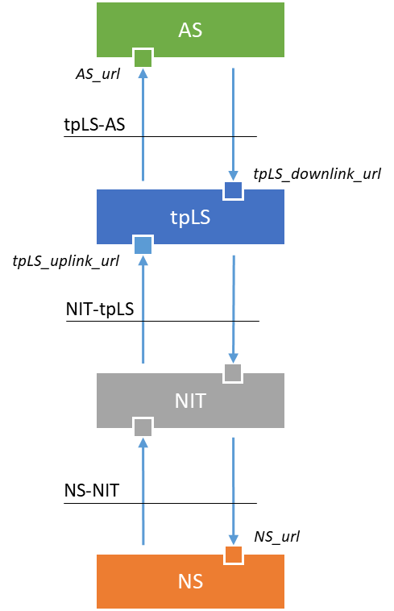

# 1. Introduction

This online documentation helps application developers and system integrations to integrate different ThingPark 
components with external systems. In the following chapters we describe different integration options and provide 
the detailed specifications of all interfaces used for those integrations.

I order to identify solution components and interfaces more easily we will use the following abbreviations:

Abbr.        | Description
-------------|-------------
__AS__       | Application Server  
__tpLS__     | ThingPark Location Solver<br/>_(TPX Location Engine)_  
__NIT__      | Network Interface Translator<br/>_(An interface proxy that receives messages from a 3rd party Network server, <br/> changes their format and forwards them to the ThingPark Location Solver.)_
__tpNS__     | ThingPark Network Server<br/>_(ThingPark Enterprise or ThingPark Wireless LoRaWAN Network Server)_
__NS__       | Network Server<br/>_(3rd Party LoRaWAN Network Server)_
__tpNS-AS__  | The interface between the _ThingPark Network Server_ and the _Application server_
__tpLS-AS__  | The interface between the _ThingPark Location Solver_ and the _Application server_
__NIT-tpLS__ | The interface between the _Network Interface Proxy_ and the _ThingPark Location Solver_
__NS-NIT__   | The interface between the _3rd Party Network Server_ and the _Network Interface Proxy_

&nbsp;

### 1.1 ThingPark Network Server &hArr; 3rd Party Application Server

This integration architecture is used to set up connectivity between any kind of LoRaWAN end devices and 
Application Servers through a ThingPark Network Server (that can be either ThingPark Enterprise or ThingPark Wireless).
   
<p align="center">

</p>

Only one interface (the tpNS-AS interface) is used for this integration. The tpNS-AS interface can apply many 
different protocols. Two of them (HTTP and MQTT) are discribed in the 'Interface Specifications' chapter.

### 1.2 ThingPark Network Server & ThingPark Location Solver &hArr; 3rd Party Application Server

<p align="center">

</p>

### 1.3 Third Party Network Server &hArr; ThingPark Location Solver &hArr; 3rd Party Application Server

<p align="center">

</p>

## 2 Integration Interfaces

### 2.1 The tpNS-AS interface

#### 2.1.1 Introduction

This section of the integration guide explains different options for integrating ThingPark Enterprise 
or ThingPark Wireless LoRaWAN network servers with external Application Servers.

Regardless of the applied integration option (http, mqtt, websocket, etc.) the message bodies are always text 
documents in either JSON or XML format.

#### 2.1.2 Message types

ThingPark Network Server (tpNS) sends/receives the following types of messages to/from the application server (AS):

  - __Uplink Frame Report__  

    _Uplink Frame Reports_ include information about standard _LoRaWAN Data Uplink_ messages including the _Payload_, 
    _FPort_, and RF parameters.

    Message body examples:
    [uplink_frame.xml](../1_tpNS-AS/message_body_examples/uplink_frame.xml), 
    [uplink_frame.json](../1_tpNS-AS/message_body_examples/uplink_frame.json)  
    Direction: _tpNS&rarr;AS_

  - __Notification Report__  

    _Notification Reports_ notify the AS about _"Device Reset"_ event, _"Successful Join Procedure"_ event
    and _"Battery status"_.
  
    Message body examples:
    [notification_report.xml](../1_tpNS-AS/message_body_examples/notification_report.xml),
    [notification_report.json](../1_tpNS-AS/message_body_examples/notification_report.json)  
    Direction: _tpNS&rarr;AS_

  - __Location Report__

    In case _Network Geo-localisation Service_ is active, ThingPark sends location reports to the AS

    Message body examples:
    [location_report.xml](../1_tpNS-AS/message_body_examples/location_report.xml),
    [location_report.json](../1_tpNS-AS/message_body_examples/location_report.json)  
    Direction: _tpNS&rarr;AS_

  - __Downlink Frame Request__  

    _Downlink Frame Requests_ are sent by the AS to the NS to schedule a downlink message on the NS. 
    The NS will enqueue the message and send it as soon as all earlier messages in the queue have been 
    sent and the device opened an RX window.

    Message body examples:
    [downlink_frame.xml](../1_tpNS-AS/message_body_examples/downlink_frame.xml),
    [downlink_frame.json](../1_tpNS-AS/message_body_examples/downlink_frame.json)  
    Direction: _AS&rarr;tpNS_

  - __Downlink Frames Sent Report__  

    A _Downlink Frame Sent Report_ notifies the AS about the event that the Network Server has sent a 
    scheduled downlink message to a device. Please note that this notification does not necessarily mean that 
    the device has successfully received the downlink message.  

    Message body examples:
    [downlink_frame_sent_report.xml](../1_tpNS-AS/message_body_examples/downlink_frame_sent_report.xml),
    [downlink_frame_sent_report.json](../1_tpNS-AS/message_body_examples/downlink_frame_sent_report.json)  
    Direction: _tpNS&rarr;AS_

#### 2.1.3 HTTP integration

In case of http integration, the information exchanged between the NS and AS are sent in HTTP POST 
message bodies. 

  - __tpNS&rarr;AS HTTP POST__  
    In case of NS to AS messages - beyond the information of the XML/JSON message bodies - the 
    NS provides further data as query parameters. This is represented by the following ```curl``` command. 
    ```
    curl \
      -X POST \
      -H "Content-type:application/json"  \
      -d '{ "DevEUI_uplink": { ... "DevEUI": "000000000F1D8693", "FPort": "2", "FCntUp": "7011", "payload_hex": "0027bd00", "CustomerID": "100000507" ... } }' \
      "<as-url>?LrnDevEui=000000000F1D8693&LrnFPort=2&LrnInfos=UPHTTP_LAB_LORA&AS_ID=app1.sample.com&Time=2016-01-11T14%3A11%3A11.333%2B02%3A00&Token=fd0b0b00464aa798a59282d64eaa70813e33bff87682880db49638569d096aad"
    ```
    Please note that Thinkpark does not use ```curl``` for sending POST messages. The above code snippet
    is used only for demonstration purpose.  
    The information provided as query parameters can be used to verify the integrity of the message body. This will be explained later
    under the _"Securing the HTTP connection"_ title.  
    If you want to set up a "quick and dirty" demo environment without security, you can ignore query parameters. 

  - __AS&rarr;tpNS HTTP POST__  
    A typical AS to NS message is a _Downlink Frame Request_ message that can be sent by the following curl command.
    ``` 
    curl \
      -X POST \
      -H "Content-type:application/x-www-form-urlencoded" \
      "<thingpark-api-url>?DevEUI=000000000F1D8693&FPort=1&Payload=00&AS_ID=app1.sample.com&Time=2016-01-11T14%3A28%3A00.333%2B02%3A00&Token=ea8f31d2299cbece8e180a3012766c4df15fe3cf2e142d9fdf4035b5894ec886"
    ```
    The same command is also available in a form of a more convenient, editable shell script: [send_downlink.sh](../1_tpNS-AS/curl_script_examples/send_downlink.sh)
    
    Please note that this script does not have a POST body. All parameters that are supposed to be part of the  message body are provided 
    as query parameters. This is optional. Using query parameters instead of JSON message body would just makes a bit easier to write 
    the ```curl``` command in a command line interface.

##### 2.1.3.1 Securing the HTTP connection

###### HTTPS

The obvious way of securing a HTTP REST API is utilizing the PKI infrastructure and accessing the AS via HTTPS. HTTPS enabled web sites require a certificate 
validated by a CA that is part of the PKI infrastructure. If your AS does not have a certificate yet, you can get one for free from 
[Let's Encrypt](https://letsencrypt.org/getting-started/).

###### Checking the integrity of messages received from the NS

Utilizing HTTPS and the PKI infrastructure for uplink messages will just secure the identity of the AS. This is not enough. We also need 
a way to secure the identity of the NS. The AS has to be able to check if the received message was really sent by the NS and not by someone else.  
For that the NS generates a unique Token for every uplink message and sends it as a query parameter like it was illustrated by the above presented ```curl```
command.

Once the AS receives a new message it has to recalculate the token and compare it with the one received as a query parameter. If the 2 tokens 
are the same, the message integrity is correct, otherwise the AS has to drop the message. 

The Token Verification Procedure is as follows:

1. The NS sends the following message to the AS
   ```
   curl \
     -X POST \
     -H "Content-type:application/json"  \
     -d '{ "DevEUI_uplink": { ... "DevEUI": "000000000F1D8693", "FPort": "2", "FCntUp": "7011", "payload_hex": "0027bd00", "CustomerID": "100000507" ... } }' \
     "<as-url>?LrnDevEui=000000000F1D8693&LrnFPort=2&LrnInfos=UPHTTP_LAB_LORA&AS_ID=app1.sample.com&Time=2016-01-11T14%3A11%3A11.333%2B02%3A00&Token=fd0b0b00464aa798a59282d64eaa70813e33bff87682880db49638569d096aad"
   ```
2. The AS cuts out the `queryParameters` subsring from the original query string of the http request __without__ the Token
   ```
   queryParameters = 
   "LrnDevEui=000000000F1D8693&LrnFPort=2&LrnInfos=UPHTTP_LAB_LORA&AS_ID=app1.sample.com&Time=2016-01-11T14%3A11%3A11.333%2B02%3A00"
   ```
3. The AS builds the `bodyElements` string as the concatenation - without separator - of the following values taken from the http request body:
   ```
   bodyElements = CustomerID + DevEUI + FPort + FCntUp + payload_hex
   ```
   The concatenation of the above described sample data looks like this: `"100000507000000000F1D8693270110027bd00"`

4. The AS re-computes the `Token` as: 
   ```
   Token = SHA-256(bodyElements + queryParameters + AsKey)
   ```
   Where: `AsKey` is the 128 bits pre-shared Tunnel Interface Authentication Key (lower case hexadecimal string representation) 
   between the AS and the NS as defined in the Generic Application configuration.

5. The AS compares the calculated Token with the received token (in the query string). If the two are not the same the AS drops the uplink frame.


#### 2.1.4 MQTT integration

MQTT integration requires an existing MQTT Broker installed and configured upfront. 
MQTT over TLS v1.2 connection is the recommended protocol to use with MQTT Brokers. 
If your MQTT broker is ready, you can set up the MQTT connection by filling in the form of the connector's setup wizard 
launched in the ThingPark Enterprise GUI.

##### 2.1.4.1 Topic pattern

The _'Generic MQTT’_ connector uses 2 topics per device, one specific topic to publish uplinks and another one to receive downlinks.

The uplink topic pattern: `<accountPrefix>/things/<deviceEUI>/uplink` 

The downlink topic pattern: `<accountPrefix>/things/<deviceEUI>/downlink`


## 2.2 The tpLS-AS interface

TODO!

## 2.2 The NS-NIT-tpLS interfaces

TODO!